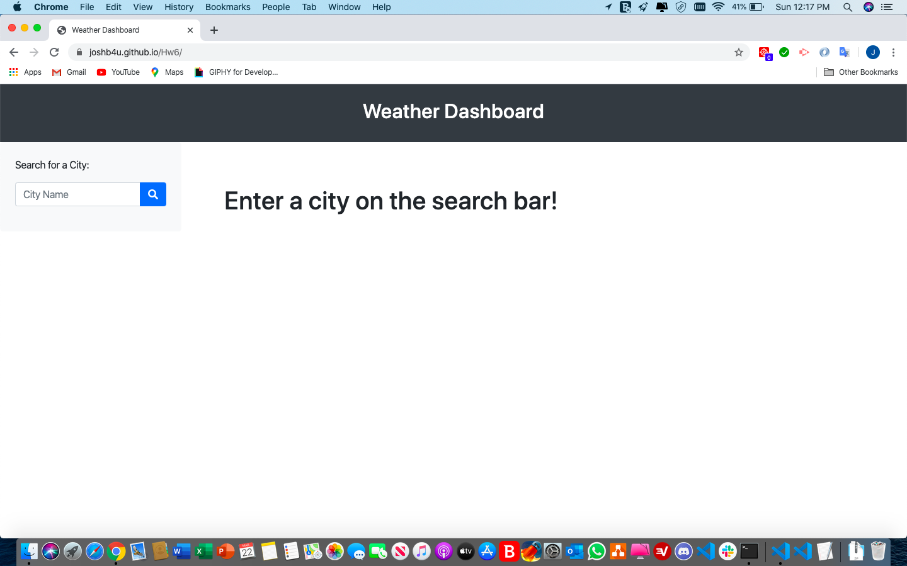
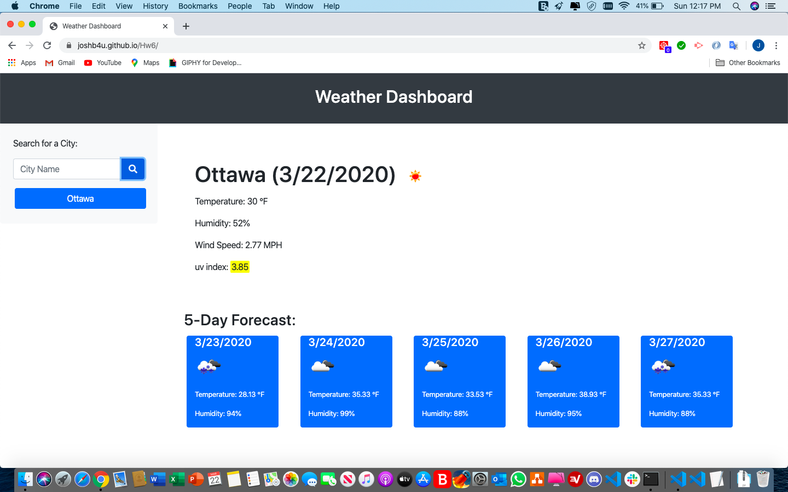
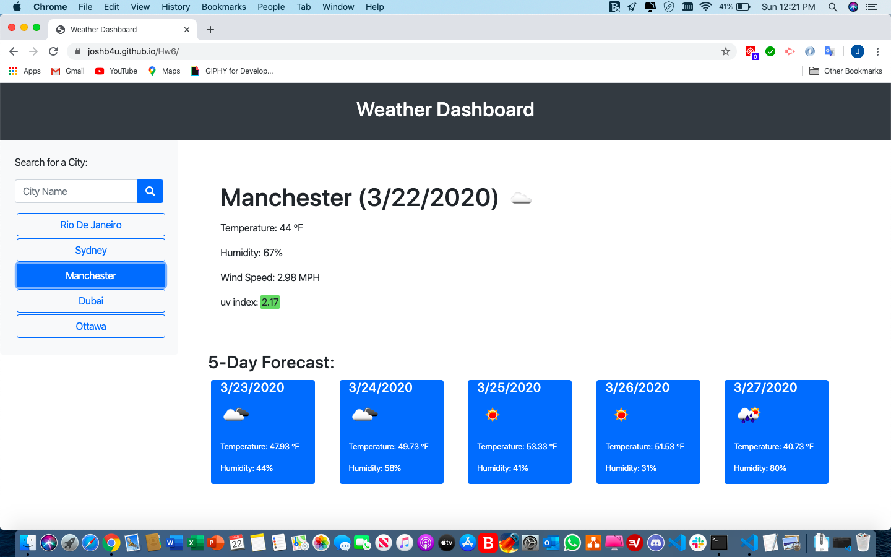
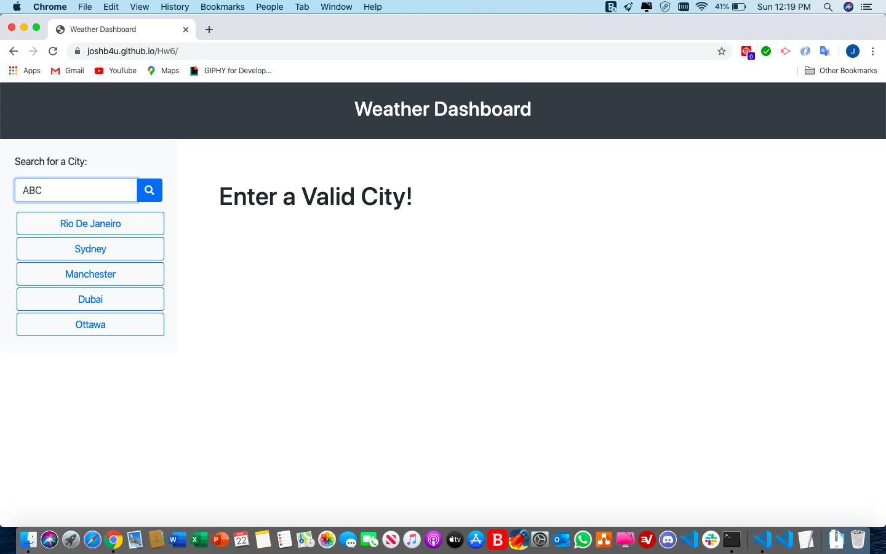

# Homework 6 - Weather Dashboard API

A Website is developed for displaying current weather information for any city, followed by a 5-day forecast for that city. If the search is successful, it will update the main display with detailed information such as temperature, humidity, wind speed, uv-index etc. and the 5-day forecast. If the search is not successful, it will ask to enter a valid city in search bar. The website also stores recently searched cities and puts them in localStorage with links to access them from history. The list dynamically updates the weather information. The OpenWeather API is used here with generated APPID key to retrieve the weather data for the cities. The Webpage has also been made responsive. For the backend jquery-AJAX method is used instead of fetch.

[Deployed Link][https://joshb4u.github.io/Hw6/]